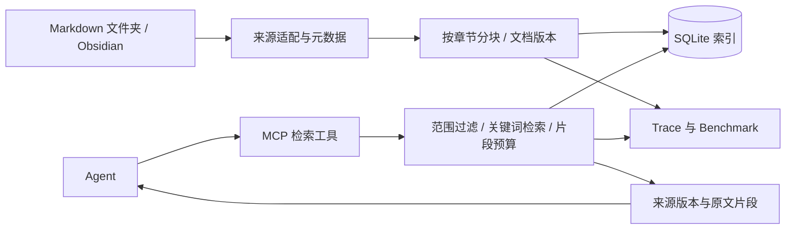

# 架构与边界

## 数据流

## 当前实现

- `config.py`：来源、索引和日志配置；相对路径始终以配置文件目录为基准。
- `index.py`：扫描、UTF-8 读取、YAML frontmatter、标题路径、行号、内容哈希与事务增量同步。
- `retrieval.py`：两个可对照的词法策略 overlap 和 BM25；中文连续双字、英文词项；分数不作置信度。
- `telemetry.py`：每次操作的阶段计时、状态、数量、返回大小和标识。
- `benchmark.py`：独立临时索引、标签校验、逐题评测、报告快照、可比性校验和对照结果。
- `server.py`：官方 MCP Python SDK 2.x 的 stdio 接口。核心检索不依赖 MCP。
- `onboarding.py`：接入状态、目录范围预览、候选索引和原子发布活动配置；每次请求读取活动配置。
- `installation.py`：注册/复用 Codex MCP、验证协议并返回当前对话中的接入提问。

原始 Markdown 由来源维护；SQLite 保存可重建的文档快照和片段。
三个检索工具保持只读，新增两个只读接入状态/预览工具与一个写本地配置/索引的接入工具，标注实际读写行为。
保存的活动配置由 MCP 和日常 CLI 使用；benchmark 使用明确传入的源配置，隔离个人接入。
文档 ID 当前为 `kb_id:relative/path.md`；改名视为删除旧文档再新增。
片段 ID 包含文档 ID、原文哈希、解析配置哈希、起止行。原文变化时旧引用应失效。

索引任务在单次事务中提交。任何文件读取或解析失败会回滚本次文档更新；根目录丢失不视为全库删除。
配置是该索引的完整来源清单：删除某来源后再次索引，会移除其旧数据。单个数据库不要供不同配置交替索引。
分块字符数是软上限，完整代码围栏和超长单行可能超出；检索正文预算是硬上限。

## 通用性的当前范围

当前配置将一个来源映射到一个知识库。以后需要“一库多来源”时，拆出 source_id 与 kb_id 并迁移文档身份。
YAML 字段完整保留；Obsidian 双向链接目前作为文本保留，不解析链接图、Canvas、Base、图片或插件数据库。
状态筛选为精确元数据筛选；不自动推断哪个记录是当前事实，宿主需要明确查询策略。

## 后续扩展点

1. 将文件加载结果统一成 Document，增加不同数据源的适配器。
2. 给词法检索器增加独立的向量检索器，Embedding 实现、模型版本与向量索引分开管理。
3. 在相同候选集预算下评估混合检索与重排。
4. 只有实际需要时再引入 Qdrant、HTTP 服务、多用户权限和后台任务。

来源参考：[MCP SDK](https://py.sdk.modelcontextprotocol.io/)、[LlamaIndex 增量处理](https://developers.llamaindex.ai/python/framework/module_guides/loading/ingestion_pipeline/)、[Qdrant 混合检索](https://qdrant.tech/documentation/search-tuning/hybrid-search/)。
