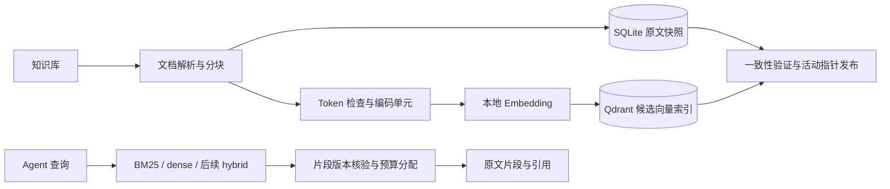

# 向量索引构建计划

状态：V1/V2 completed（2026-10-10）；V3候选构建/缓存更新/失败恢复与V4公开合成基线可用。
Server部署、清理、独立真实问题集仍待完成。语义成绩见 [EXP-0007](experiments/0007-switchable-embeddings.md)。
相关决策：[ADR-0002](decisions/0002-vector-storage.md)。

V1 实测见 [EXP-0006](experiments/0006-vector-store-contract.md)。存储manifest不可覆盖，
共同活动指针原子发布SQLite/Qdrant代次，CLI和MCP读取同一快照；使用方式见 [Embedding说明](embeddings.md)。

## 最小目标

同一份知识库能使用 BM25 与 dense 检索，向量可持久化，修改与删除可同步，版本可核验，效果可比较。
MCP 保持原文读取与接入流程，在搜索参数中增加明确策略；Vector Index 未就绪时不冒充语义检索。

## 分阶段交付

| 阶段 | 交付 | 学习重点 | 验收 |
| --- | --- | --- | --- |
| V1 存储契约 | EmbeddingProvider、VectorStore、Qdrant适配、索引manifest | 向量维度、距离、点身份、payload过滤 | 使用固定测试向量完成持久化/查询/过滤/删除；不能称为真实语义能力 |
| V2 真实编码 | 可选本地E5编码、输入模板、token窗口、向量缓存 | 文档与查询编码、归一化、输入长度 | 真实模型固定版本；无静默截断；缓存命中和资源可测 |
| V3 构建与维护 | vector-build、vector-status、代次发布、增量复用与删除 | 双存储一致性、可重建索引 | 失败保留上一就绪代次；重启可用；变化只重算必要单元 |
| V4 检索与评测 | dense策略、MCP参数、基线对比、真实问题集 | 语义收益、精确词退化、上下文代价 | 公共/私有评测分别记录；质量、耗时、返回大小均有对照 |
| V5 混合检索 | 同等返回预算下融合BM25与dense | RRF与候选预算 | 单独实验，披露类别收益与退化，不同时更换模型或切块 |

实施顺序按V1→V2→V3→V4推进，V5根据结果开展。V1/V2可用公开示例验证，实际用户语料仍按已确认范围接入。

## 模块和配置

已新增接口及存储契约；其余按阶段实现：

- `embeddings.py`：EmbeddingSpec 与 Provider 协议、维度/有限数/归一化验证。
- `embedding_providers.py`：本地ONNX/API编码、完整token窗口、按角色与输入/模型契约区分的缓存。
- `vector_store.py`：已实现 VectorStore 与 Qdrant memory/local/server 适配；服务端运行待验收。
- `vector_index.py`：来源/模型/代次manifest、指纹核验及不可覆盖保存；`dense_index.py`实现候选构建与共同活动指针。
- `vector_check.py`：固定向量本地存储验收，记录阶段耗时、版本与失败报告。
- `config.py`：可选向量配置，缺省保持BM25；密钥只读具名环境变量。
- `onboarding.py`：序列化新配置与状态，接入新来源后旧向量指针失效，明确手动重建；不会在接入时隐式下载或调用API。
- `retrieval.py`：共同过滤/引用/预算，dense窗口候选分页、父片段去重、来源版本核验。
- `cli.py`、`server.py`：下载/验收/构建/状态与策略参数，查询复用已加载模型。
- `benchmark.py`、公开摘要导出：模型/窗口/CPU参数、构建和编码指标、阶段时间、峰值工作集；过滤本机配置和原始来源身份。

配置需包含：provider、模型ID与revision、维度、最大输入token、距离函数、归一化、模板版本、batch_size、device、
Qdrant运行模式/地址、collection前缀、缓存与manifest位置、候选数量和精确/近似检索设置。
不要在公开配置里保存本机地址细节、凭证或真实collection清单；公开示例只含通用占位值。

## 数据与身份

现有文档ID与chunk_id继续作为原文引用身份，chunk_id目前包含source_hash，因此一份文档改变会换掉它的片段身份。
编码缓存不能只用chunk_id：采用 `hash(EmbeddingSpec + input_template + 实际编码文本)`，允许未变化段落在新代次复用。
元数据或标题参与编码时，其变化必须改变缓存身份。

Qdrant point ID使用确定性UUID映射，不能直接将64位十六进制chunk哈希当作可接受的point ID。
point payload保存：kb_id、doc_id、parent_chunk_id、embedding_unit_id、source_hash、generation、model_spec_hash和需要过滤的元数据。
不把整段原文复制到payload中；向量本身、来源身份与过滤元数据仍属于私有数据。
检索先按generation/知识库/元数据过滤，再排名，不能先找全局top-k后过滤造成召回缺失。
返回前回查SQLite，校验parent_chunk_id、source_hash和活动代次，去重后按共同正文预算输出。

## Token长度处理

现有分块上限是字符软限制，代码围栏或长单行也可能超出。小模型512token限制必须包含前缀、标题和正文。
默认用模型tokenizer生成完整覆盖的编码窗口，保留父chunk身份；多个窗口命中同一父chunk时合并去重。
不得静默只向量化正文开头。标题占满预算或查询超限时给出明确错误/拆分建议，并记录计数。
第一轮BM25与dense仍返回同样的父chunk，以减少“模型收益”和“引用单位变化”的混淆；窗口配置需在报告中说明。
真实token窗口及模型切换会成为独立实验参数，后续可对比较长上下文模型。

## 构建、更新与失败恢复

1. 明确选定活动源配置，生成语料snapshot和输入manifest。
2. 在候选SQLite快照中解析文档与分块；冻结本次来源版本。
3. 查编码缓存，批量编码缺失单元；校验维度、有限数值、归一化与结果数量。
4. 将点写入独立候选collection；等待写入完成，核对点数和manifest覆盖。
5. 验证过滤、回查、引用与模型契约；核对源范围没有在构建中变化。
6. 原子发布单一活动manifest，其中共同指向SQLite快照和Qdrant collection。
7. 保留旧代次供在途查询和回退；明确的清理命令只删除本项目未引用代次，不自动清理其他collection。

先实现可恢复的全量候选构建，加上编码缓存复用；随后优化候选点复制与删除，不一开始就做跨库就地更新。
无变化时不得重新向量化；文档变化后旧point不能在新代次被查询，删除/移除来源需同步移除引用。
Embedding或数据库失败时记录失败阶段，新代次不发布；BM25保持可用，但切换须明确显示，不能静默冒充dense。
vector-status返回not_built/building/ready/stale/failed，包含当前模型契约和代次摘要；详细身份只保存在私有manifest。
本地服务建议单写者控制构建；多个Agent只读共享同一Qdrant服务，避免local模式持久化锁冲突。

## 检索与实验

第一轮dense使用精确向量检索，先建立相似度与效果基线。HNSW近似搜索作为后续性能实验，记录索引参数与相对精确top-k的召回。
搜索过程新增query_tokenize、query_embed、vector_query、source_resolve、pack计时；冷模型加载与暖查询分开。
知识库/状态过滤要在两路生效；“最新”“已完成”等结构化问题不能仅依赖向量排名，应继续依据日期/状态元数据。
相似度分数不解释为回答置信度；dense可能对无答案问题也返回候选，必须单独报告此退化。

公共smoke-v1用于工程回归，其高召回和小规模不能证明真实语义收益。私有真实查询集至少建立开发集与保留测试集，
涵盖同义改写、准确项目名、中英术语、跨笔记、状态/日期、无答案和跨库范围。
同一语料、相同父chunk、top_k、正文预算对比BM25与dense；报告模型/模板/token窗口为明确实验变化。
后续hybrid用固定两路候选预算和RRF，保持最终输出预算一致；候选计算额外开销单独记录。

当前benchmark逐次检查完全相同分数。引入模型/近似检索后需定义数值容差、固定种子、稳定并列排序，并报告排名变化，
不能删除确定性检查来掩盖不稳定。近似检索若非确定性，逐次质量需聚合并披露波动。

## 数据记录与验收门槛

| 环节 | 必须记录 |
| --- | --- |
| 解析与输入 | 文档/父片段/编码单元数、token分布、超限与覆盖、语料/模板/模型指纹 |
| 编码 | cache hits/misses、编码token、batch/device、冷启动时间、批次耗时、失败数、内存/显存 |
| 存储 | collection/代次、待写/已写/删除点数、upsert耗时、磁盘占用、覆盖率、服务版本 |
| 查询 | query token、编码与向量查询耗时、过滤后候选、源解析、p50/p95、正文/JSON量 |
| 效果 | Recall/MRR/nDCG、无答案候选情况、按类别与逐题收益/退化、范围泄漏 |

硬约束：未兼容模型不混用；点覆盖率100%；引用版本一致；范围外结果为0；无变化编码调用为0；删除不再命中；
失败不替换就绪代次；原文/日志/向量与模型缓存不出现在发布候选中。
语义效果不预设虚构的提升百分比：实际主要指标改善且退化被披露后，才考虑更改默认策略。
假向量只验证存储和流程，不能用于宣称语义检索效果。

## 私有数据与部署

模型缓存、向量本地文件、manifest、编码缓存和报告放 `.state/`/`.local/`，继续执行发布检查。
真实语料与查询不进入公共样例；公开的计划、接口与代码可以发布。
Docker服务与模型运行环境属于本机记录，写入 `.local/`；实施前检查服务可用性并固定依赖，不把本机配置写进公开计划。
V1固定向量隔离测试，V2之后先用公开演示数据验证再按既有确认范围构建私有索引。模型、实际配置与产物默认放项目盘的忽略目录。
